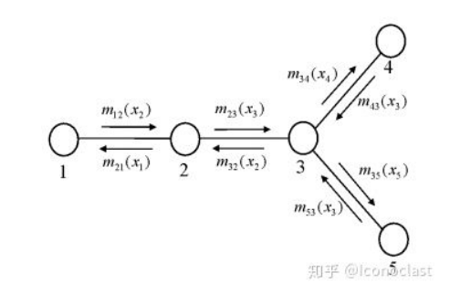
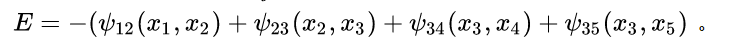
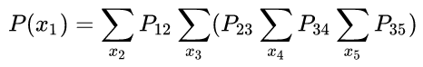
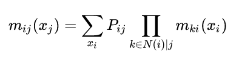
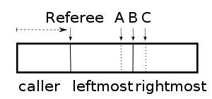
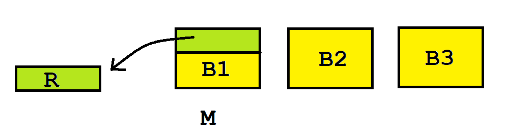

## 趣题摘记

> 记录遇到的有趣的题和知识点。主要是数学和算法问题。

## 目录
+ [一个简单游走问题](#一个简单游走问题)
+ [一个概率构造问题](#一个概率构造问题)
+ [一个概率构造和计算问题](#一个概率构造和计算问题)
+ [BP 算法](#BP-算法)
+ [一个简单抛硬币问题](#一个简单抛硬币问题)
+ [一道2018北大集训的题](#一道2018北大集训的题)
+ [一个有趣的分蛋糕问题](#一个有趣的分蛋糕问题)
+ [一道有趣的近似算法题](#一道有趣的近似算法题)
+ [一道最小生成树的证明问题](#一道最小生成树的证明问题)
+ [线性规划的基本理论](#线性规划的基本理论)

## 一个简单游走问题

- 初始时你在数轴的位置 $0$ 处。每单位时间你能向左或者向右走一格。
- 问第一次走到 $1$ 的期望步数。
- 解法一：
    + 设 $f_i$ 表示正好向右走了 $i$ 步的期望。得 $f_i=\frac{1}{2}(f_{i-1}+f_{i+1})+1$ 且 $f_0=0$，联立化简后得 $f_i = 2f_{i-1}-f_{i-2}-2(i \geq 2)$。继续化简得 $f_i=(3i-4)f_1-(i-1)i$。
    + 我们要求的是 $f_1$。假设 $f_1=x$，则 $f_n=(3n-4)x-(n-1)n$，当 $n \rightarrow +\infty$ 时 $f_n \rightarrow -\infty$，显然矛盾。所以 $f_1=+\infty$
- 上述做法太麻烦了。解法二：
    + 设 $f_1$ 表示正好向右走了一步的期望。注意期望是有可加性的，所以$f_1=\frac{1}{2}(0+2f_1)+1$，化简得 $f_1=f_1+1$。显然 $f_1=+\infty$。

## 一个概率构造问题

- 一个函数 $f()$ 会以 $p$ 的概率返回 $1$，以 $1-p$ 的概率返回0。
- 要构造一个函数 $g()$，以正好 $0.5$ 的概率返回 $0$ 和 $1$。
- 注意：$p$ 是一个固定但是未知的概率。
- 解法一：
    - 连续调用两次 $f()$，显然返回 $01$ 和 $10$ 的概率相同，我们可以根据这个来决定 $g()$ 的返回，如果返回值相同，就继续这么操作。显然，当 $p \rightarrow 0/1$ 时，这个的期望步数趋于无穷大。
- 解法二（改进）：
    - 我们可以设计算法使期望步数进一步下降。
    - 对于询问序列的一个前缀长度 $n$，一旦 $C_n^m$ 是偶数（$m$ 是返回的 $1$ 的个数），其实我们就能立即结束并得到返回值（总能分成两半）。
    - 如何决定返回什么呢？每次看当前01序列和它的回文哪个字典序小，一样就递归一半，复杂度是 $O(N)$ 的。
    -  [知乎](https://www.zhihu.com/question/304075115) 上有更详细讨论。

## 一个概率构造和计算问题

- 有 $100$ 个人被编号为 $1 \sim 100$，对应他们编号的 $100$ 个号码牌被打乱顺序放在了$100$ 个抽屉里。每个人可以打开至多半数的抽屉，并从中找出对应自己编号的号码牌。只有所有人都找到了自己的号码牌，任务才算成功（所有人会依次独立地操作，彼此不能交流，操作完后所有抽屉都会复原）。**假设抽屉的各种放置状态出现的概率均等**，设计一种固定的策略，所有人都成功的概率尽可能的大。
- 成功的概率比直觉上要高很多。
- 策略：**首先打开自己号码的抽屉，如果没中，继续打开抽屉里号码牌对应的抽屉……重复50次。**。
- 分析：
    + 显然，所有人都能找到自己，当且仅当所有圆环的长度不超过 $50$。
    + 下面就是要计算，对于一个随机排列，置换环长度全都不超过 $50$ 的概率是多少。
    + 容斥。从 $100$ 个数中选出 $m(> 50)$ 个数构成大环（剩下的随便排）的方案数是：$C_{100}^m \cdot (m-1)! \cdot (100-m)!$
    + 所以最终答案为 $P=1-\sum \limits_{m=51}^{100} \frac{1}{m}$。且当 $n \rightarrow \infty$ 时，$P \rightarrow 1-\ln{2}$

## BP 算法

- 描述
    + 已知联合分布函数 $F(x_1,x_2,...x_n)$ （可以设 $x_i=0,1$ 来简化思考），求每个 $x_i$ 的边缘分布函数。
    + 一般认为联合分布函数比较“稀疏”，可以用一张无向图（因子图, factor graph）来描述（点是变量，边是两个变量之间的条件概率函数，设为 $\Phi_{i,j}$）。
    + 例子：一个五个变量的因子图以及信息的传递。
    
- 转化
    + 一般认为，可以从物理角度去解析某个概率分布的构型。具体地，设上述图的能量为：
        
    + 这样，某构型 $E=\{x_1,x_2...x_n\}$ 出现的概率是 $\frac{1}{normalize} e^{-E}$
    + 不是很懂实际的物理意义，我将这部分转化理解为：将求边缘分布函数 $f(p)$ 的累乘通过取 $\log$ 转化为累加。
    + 取完对数后，比如我们要求的 $P(x_1)$ 就可以表示为：
         
- 迭代过程
    + 迭代其实就是把上述式子不断累加求出来的过程。
    + 定义点 $i \rightarrow j$ 的 `message` 为：
        
    + 很显然，上述式子是一个迭代的过程。且易得 $P(x_i) = \prod \limits_{j \in N(i)} m_{ji}(x_i)$

## 一个简单抛硬币问题

- 抛一枚质地均匀的硬币。问期望多少次抛出连续两个向上。
- 解法：这一类期望问题都不宜直接在序列上计算，可以直接根据概率的意义计算。设 $f_i$ 表示连续抛出 $i$ 个向上的期望抛硬币次数。显然 $f_1=2,f_i=f_{i-1}+1+\frac{1}{2}f_i$，化简得 $f_i=2f_{i-1}+2$，原问题里 $f_2=6$。

## 一道CCPC2019的题

- 比完后再更

## 一道2018北大集训的题

- 描述
    + 已知 $N$ 个数中恰好有 $k$ 个不同的数字出现了奇数次。
    + 只能扫一遍，要求出这 $k$ 个数。$N$ 很大，$k \leq 10$，内存很小。

- 以前只会做 $k \leq 2$ 的版本……

- 一个子问题
    + 对于一个数字集合 $S$，如何判断是否只有一个数字出现了奇数次（还要支持动态加数字）？
    + 给出一个概率做法：
        - 取一个模数 $P$（如 $998244353$）以及模域下的一个常数 $c$。
        - 对于每一个进来的数 $x$，取一个映射 $f(x)=y$，只维护该集合 $y$ 的异或和 $xor_y$。其中 $f(x)=rP+c$，$r$ 每次都是随机的。
        - 如果只有一个数字出现了奇数次，必然有 $xor_y \mod P=c$；反之，我们**可以**认为不成立。
        - 不放心的话可以多取几个模数。如果还要还原方案，再维护一下 $x$ 的异或和即可。
    + 注意到，**这个做法还支持快速子集合并**。

- 做法
    + 维护 $m$ 个数字集合（比如取 $m=20$），彼此独立。
    + 每次来了一个数字 $x$ 后，依次枚举集合。每个集合都有 $\frac{1}{2}$ 的概率接受这个数字。
    + $N$ 个数字插入完成后，用 $2^m$ 枚举数字集的子集。对于一个子集 $S$，用上述做法合并对应数字集，看看总集合里**是否只有一个数字 $t$ 出现了奇数次**。如果是，他必然是这 $k$ 个答案中的一个。
    + 枚举完所有子集后，汇总去重即为答案。**这是个概率做法，可能会漏解**（但是准确率其实很高）。

+ 准确性高的直观分析
    + 假设 **子问题的判定是绝对正确的**（多取几个模数即可）。
    + 考虑一个行数为 $k$，列数为 $m$ 的01矩阵。$0$ 和 $1$ 表示这个答案 $t$ 在这个数字集里是否出现奇数次。
    + 如果能枚举到所有 $k$ 个答案，说明对于每一行，都存在至少一个列集合 $S$，满足列集合异或后是这一行的 `one hot`。进一步能推导出，这个矩阵满秩（在在异或空间下考虑问题）；反过来，如果该矩阵满秩，列向量就能组合出所有 $2^k$ 列向量，当然也能拼成 `one hot`。所以说，**能搜到所有解和矩阵满秩是充要的**。
    + 由之前的随机做法，可以认为矩阵的每个元素出现 $0$ 和 $1$ 的概率均等。现在我们来估计出错（不满秩）的概率：对于前 $n-1$ 行，随便取 $01$ 的状态；如果第 $n$ 行和它们 $2^{n-1}$ 子集异或和都不同，就可以满秩。所以不满秩的概率约为 $\frac{1}{2^m} \cdot 2^{n-1}$ 。

## 一个有趣的分蛋糕问题

+ 注：做法均参考自 [知乎](https://www.zhihu.com/question/20615717/answer/15646804?utm_source=qq&utm_medium=social&utm_oi=623133927297257472&hb_wx_block=1)

+ 若干个人要分蛋糕吃。**注意，每个人对蛋糕各部分价值的评估是不一样的**。有以下两种要求：
    - 公平：每个人都认为，自己得到的部分不低于（自己视角下）总蛋糕价值的 $\frac{1}{n}$。
    - 无怨：每个人不觉得别人拿的比自己多。（显然**无怨一定公平**）

+ 三人切蛋糕的连续解法
    - 需要一个裁判，从左向右走刀，三人拿着刀站在裁判右边，保持在（按各自标准）平分右边蛋糕的位置。任何时刻一旦三人中有一个喊「切」，此人获得裁判左边的蛋糕。然后三人中位于中间位置的那位（`B`）把刀切下。没蛋糕的两位中，离裁判近的那位获得中间那块，远的那位获得右边那块。

        

+ 三人切蛋糕的离散解法
    1. `A` 按照自己的标准把蛋糕切三块。
    2. 如果 `B` 认为最大的两块一样大，那么按 `C，B，A` 的顺序选蛋糕，**结束**。
    3. 如果 `B` 认为其中一块 `M` 最大，他就从 `M` 削去一小块 `R`，使之与第二大的那块一样大，把 `R` 放在一边。
    4. 称 `M` 剩下的部分为 `M'`。
    5. 按 `C，B，A` 的顺序选这三块蛋糕，但有个要求是，如果 `C` 没有选走 `M'`，`B` 须被迫选走它。
    6. `B` 和 `C` 中没拿 `M'` 的那位，把 `R` 分成三份，让拿了 `M'` 的那位先挑一份，然后 A 选一份，最后一份留给自己。
        
    - 分析：
        1. 先来证明 `C` 的无怨。第一轮选择的时候他有最优先权：如果他认为 `B1`（即算法里的 `M'`） 最优，那么它在第一轮能先选走自己认为最大的，而且可以在第二轮均分蛋糕，使得第二轮自己也能拿 `R` 中至少 `1/3`，肯定是无怨的；如果他认为 `B2` 或者 `B3` 最优，它将在两轮选蛋糕里都最先选走自己认为的最大的，显然无怨。
        2. 再来证明 `B` 的无怨。经过削蛋糕操作后， 他眼中 `B1=B2>B3`——所以如果 `C` 选走了 `B1` 或 `B2` 中的任意一个，`B` 将选走它们中的另一个（`C` 选走 `B3` 的话，`B` 被迫选走 `B1` 也不亏）。而且在第二轮里，`B` 拥有切或者先选的权力，分析同上，也是无怨的。
        3. 再来证明 `A` 的无怨。`A` 一开始在切的时候，是把蛋糕按照自己的标准均分的，所以在他眼中，`B2=B3>B1`。由规则保证，第一轮分蛋糕时 `B1` 一定会被选走，所以在第一轮中， `A` 尽管获得剩下的蛋糕，也是无怨的。此时在 `A` 眼中，拿了 `B1` 的人最后的总价值超不过他，他只需在第二轮中考虑剩下的那个人。没拿 `B1` 的人将在第三轮最后选，所以 `A` 挑剩下两块中自认为价值大的，他获得的总价值也不会低于没拿 `B1` 的人。

+ $N$ 个人切蛋糕的离散解法
    1. 第一个人切出他认为的 $\frac{1}{n}$。
    2. 剩下的人按顺序判断一下：这一份在他眼里是不是太大。如果较大就削至 $\frac{1}{n}$ 并进原来的蛋糕，不是的话跳过。
    3. 所有人都判断过后，这一块给最后削过蛋糕的那位（如果没有人削过蛋糕，这块给第一个人）。
    4. 每次 $N$ 的规模减一。重复操作 $2 \sim 4$ 直至分完。

## 一道有趣的近似算法题

+ 题目描述
    - 给定联通无向图 $(V,E)$ 和若干个顶点集合 $S= \{ t_1,t_2,⋯,t_{|S|} \} $
    - 要求选出边权和最小的边，使得任意 $S$ 中的点联通。

+ 确定性做法
    - 在ICPC竞赛里，这是一道很经典的斯坦纳树问题。
    - 设 $f_{S,i}$ 表示使“以$i$ 为根，点集为 $S$”的树连通的最小边权和。
    - 对于一种状态 $(S,i)$，有两种转移方式：
        1. 将 $S$ 拆成两个子集 $S_1$ 和 $S_2$ 转移（相当于这棵树有至少两个子树）。
        2. 枚举点 $j$ ，用 $f_{S',j}+E_{j,i}$ 转移（相当于这棵树只有一个子树，枚举子树顶点）。
    - 复杂度是 $O(n3^n)$。

+ 一个有趣的近似做法
    - 构造一个新图 $(S,F)$，对于原图中 $S$ 中的每一对顶点 $(i,j)$，连一条边权为 $F_{i,j}$ 的边，其中 $F_{i,j}$ 是原图中 $i$ 到 $j$ 的最短路。
    - 在新图上跑一遍 $MST$ 得到一个边集 $E_{result}$.
    - 显然这组边一定是原图的一个解。

+ 证明近似度
    - 在原图中，考虑一个包含 $S$ 的路径 $P= \{ p_1,p_2,...,p_k \} $.
    - 任意找出路径上的 $S$ 子序列 $Q= \{ q_1,q_2,...,q_{|S|} \} $. $P$ 中 $q_i \rightarrow q_{i+1}$ 的路径边权和，必然不小于新图中的 $F_{q_i,q_{i+1}}$.
    - 假设原图最优解的边集是 $E_{answer}$。将 $E_{answer}$ 中的每条边都复制一遍，可以得到一张欧拉图，且能导出一个 $P$ 路径。
    - 由以上分析可知，$\sum E_{q_i,q_{i+1}} \geq \sum E_{result}$。即 $2\sum E_{answer} \geq \sum E_{result}$.
    - 考虑一个边权都相等的菊花图。当 $n \rightarrow +\infty$ 时，$E_{result} \rightarrow 2\sum E_{answer}$.
    - 所以该做法的近似度正好是 $2$.

## 一道最小生成树的证明问题

+ 题意
    - 在 MST 问题中，定义一个解的邻域为：删掉一条边并加上一条边后能到达的所有解。
    - 证明：一个局部最优解必然是全局最优解。

+ 证明：
    - 先简化问题，假设所有边权值都不相同。
        1. 设局部最优解是 $T$，全局最优解是 $T^*$。将局部最优解连成一棵树。
        2. 反证，假设 $T$ 不是全局最优解。则至少存在一条在$T^*$中的非树边 $E=(u,v)$。
        3. 在 $T$ 里找到 $u \rightarrow v$ 的路径，依次经过了 $e_1,e_2,...e_k$ 这些边。由条件可知，$\max \limits_{i=1..k} c(e_i) < c(E)$ （否则就不是局部最优解了）。
        4. 显然，$u \rightarrow v$ 的路径中，必然存在一条边 $e_i=(p,q)$，使得 $p$ 和 $q$ 属于不同的集合。我们在全局最优解里删掉边 $E=(u,v)$，加入边 $e_i$。全局最优解答案更变得更优，产生矛盾。
        5. 所以（任意一个）局部最优解必然是全局最优解。
    - 现在考虑权值可以相同。
        1. 在之前的第 $3$ 步里，条件变成了 $\max \limits_{i=1..k} c(e_i) \leq c(E)$。
        2. 在之前的第 $4$ 步里，有可能会出现 $c(E)=c(e_i)$，此时替换边后权值不变，无法导出矛盾。
        3. 注意到，**$T$ 中存在 $e_i$ 不存在 $E$，$T^*$ 中存在 $E$ 不存在 $e_i$**。我们还是做一下边的替换，得到变换后的“等价局部最优解” $T'$。
        4. 经过了这样一次变换后，$T^\{'}$ 和 $T^{\*}$ 之间重复的边增加了一条。重复上述的流程，直到导出反证法的矛盾或是推出 $T'=T^*$。
    - 注意，上述的证明过程是**有漏洞的**。**在变换了 $T$ 后，我们并没有证明 $T^{\'}$ 在它的邻域也是最优的，就不能应用局部最优解的性质。** 可以反过来进行修正：
        1. 同上述步骤，找到一条非树边 $E$。如果 $c(E)=c(e_i)$，我们固定 $T$ 不动，把 $T^*$ 里的边 $E$ 替换成 $e_i$。
        2. $T$ 和 $T^{\'}$ 之间重复的边增加了一条。重复上述的流程，直到导出反证法的矛盾或是推出 $T=T^{'}$。
    - **一个牛逼的证法**
        1. 之前的证明需要一步步调整，其实可以**一步到位**。
        2. 在取 $T^*$ 的时候，我们不妨在所有全局最优解里，取一个 **和 $T$ 重复的边最多的解**。
        3. 如果 $T^* \ne T$，存在一个 $T'$ 使得 $T'$ 里 $T$ 重复的边更近，但是这和 $T^{\*}$ 的条件矛盾。所以 $T^{\*}=T$。

## 线性规划的基本理论

#### 标准型和对偶

test

+ 线性规划的标准型：

 maximum $\pmb{c}^T\pmb{x}$ 

 $\pmb{A}\pmb{x} \le \pmb{b}$

$\pmb{x} \ge \pmb{0}$

+ 它的对偶问题为：
	
minimum $\pmb{b}^T\pmb{x}$
    $\pmb{y}^T\pmb{A} \ge \pmb{c}^T$
    $\pmb{y} \ge \pmb{0}$

